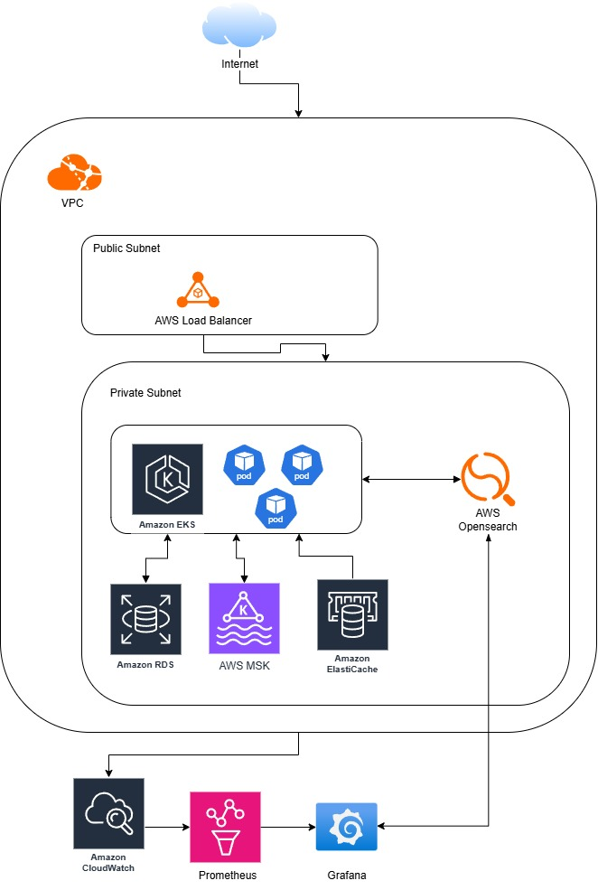

Explanation: 
1. Load Balancing

- Service: AWS Application Load Balancer (ALB)

  Purpose: Distributes incoming traffic (500 req/sec) across EKS worker nodes.
  
- Configuration:

  Public-facing ALB in multiple Availability Zones (AZs).
  Target group points to EKS-managed pods running the application.
  Health checks ensure only healthy pods receive traffic.

2. Containerization Management

- Service: AWS EKS Cluster
    Purpose: Runs containerized microservices (e.g., API servers).
  
- Configuration:

  Cluster Size: Start with 3-5 worker nodes (e.g., m5.large instances with 2 vCPUs, 8 GiB RAM each).

  Auto Scaling: Use Horizontal Pod Autoscaler (HPA) and Cluster Autoscaler:
  
  HPA scales pods based on CPU/memory utilization (e.g., target 70% CPU usage).

  Cluster Autoscaler adds/removes nodes based on pod demand.

  Workload: Deploy microservices (e.g., 10 pods per service) using Kubernetes Deployments.

  Throughput: Assuming each pod handles ~50 req/sec, 10 pods can handle 500 req/sec with room for growth.

  Networking: Use AWS VPC CNI plugin for pod networking and integrate with ALB.

  Example Pod Spec:

  Container image: Your app (e.g., Node.js, Spring Boot).

  Resources: 0.5 vCPU, 1 GiB RAM per pod.

3. Cache  (Amazon ElastiCache)
- Service: Amazon ElastiCache for Redis

  Purpose: Caches frequently accessed data (e.g., user sessions, database query results) to reduce load on PostgreSQL.
- Configuration:

  Instance Type: cache.m6g.large (2 vCPUs, 6.37 GiB RAM).

  Replication: Multi-AZ with a primary and replica node for high availability.

  Capacity: Start with 1-2 nodes, scale out based on cache hit rate and eviction rate.

  TTL: Set appropriate expiration times (e.g., 5 minutes for session data).

  Throughput: Redis can handle thousands of ops/sec per node, so 500 req/sec is easily manageable.

  Integration: Application connects via Redis client (e.g., ioredis for Node.js).
4. Data Streaming and Message Processing (Amazon MSK)
- Service: Amazon MSK
  
  Purpose: Streams real-time events (e.g., user actions, logs) for processing by downstream services.
- Configuration:
  
  Cluster Size: Small cluster with 2-3 brokers (e.g., kafka.t3.small).
  
  Topics: Create topics like user-events, logs with 2-4 partitions for parallelism.
  
  Throughput: Configure for ~500 messages/sec (assuming 1 request = 1 message).
  
  MSK default throughput is ~1 MB/sec per broker; scale partitions or brokers if payload size increases.
  
  Consumers: Deploy Kafka consumer microservices in EKS to process streams (e.g., for analytics or notifications).
  
  Retention: Set retention period (e.g., 24 hours) based on use case.
  
  Security: Enable TLS encryption and IAM authentication.

5. Database Layer (AWS RDS for PostgreSQL)

   Service: Amazon RDS for PostgreSQL

   Purpose: Persistent storage for relational data (e.g., user profiles, orders).
- Configuration:
  
  Instance Type: db.t4g.large (2 vCPUs, 8 GiB RAM) or higher based on query complexity.
  
  Multi-AZ: Enable for failover and high availability.
  
  Storage: 100 GiB General Purpose SSD (gp3), with IOPS configured for 3000 (adjust based on write load).
  
  Read Replicas: Add 1-2 read replicas if read-heavy (e.g., 400 req/sec reads, 100 req/sec writes).
  
  Connection Pooling: Use PgBouncer or RDS Proxy to manage connections efficiently (500 req/sec may require ~100-200 concurrent connections).
  
  Performance: Optimize queries and indexes; ElastiCache should offload most read traffic.
6. Networking and Security

- VPC: Deploy all components in a VPC with public and private subnets:

- Public subnets: ALB.

- Private subnets: EKS nodes, ElastiCache, MSK, RDS.

- Security Groups: Restrict traffic (e.g., ALB → EKS, EKS → ElastiCache/MSK/RDS).

- IAM Roles: Use IRSA (IAM Roles for Service Accounts) for 
EKS pods to access AWS services securely.

7. Monitoring and Logging
- Amazon CloudWatch: Monitor EKS (CPU/memory), ElastiCache (cache hits), MSK (throughput), and RDS (connections, IOPS).

- Logs: Stream EKS pod logs to CloudWatch Logs or an external system via Fluentd to Opensearch
- Prometheus: Collect all metrics from the pods, EKS Cluster , AWS Cloudwatch and create alert based on the thresold to ease the monitoring
- Grafana : Dashboard for monitoring the logs from Opensearch and Prometheus

8. Cost Saving Options:
- Buy EC2 reserved instances / Saving Plans : Buy saving plans start from 1 years to 3 years to save 20-40% on RDS, EKS Nodes ( EC2 Instance ), and Elasticache 
- Spot instance for non critical workloads: Use AWS EC2 Spot Instance to save around 50-70% on compute cost
- Continous right sizing: Continue to right size the AWS resource based on the trending and metrics and also right size the resource on EKS Pods , to make sure no workloads that is under utilized
- Use AWS ECR to store container images and configure it to use AWS ECR Private Link to avoid additional cost on data transfer to pull container images from public internet 